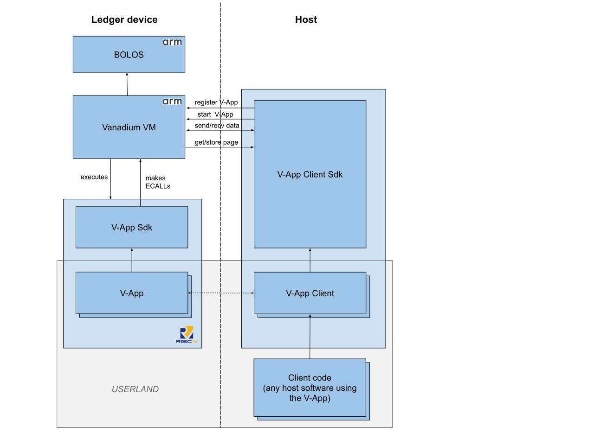

# Compilation targets

With the exception of the Vanadium app itself, which is an embedded Ledger app on the `ARM` target, all the other crates target either the `native` or the `riscv` targets.

- The `native` target is what is running in your machine.
- The `riscv` target is currently `riscv32imc-unknown-none`.

> **⚠️ WARNING: The native target is insecure.**  While it is possible to compile and run the V-Apps on native targets, this is only intended for development and testing purposes. The cryptographic primitives are not hardened against side channels, or other kinds of attacks.

# Architecture

## System crates

In the above chart, all the crates outside *USERLAND* are developed as part of the Vanadium project.

* `vanadium`: This is a Ledger application, targeting the ARM embedded platform that is used by Ledger devices. It contains the VM, code to register and run V-Apps, and provides the implementation of all the system services (via Risc-V ECALLs) to V-Apps. It interacts with the operating system ([BOLOS](https://www.ledger.com/academy/security/our-custom-operating-system-bolos)) in order to provide access to low level primitives, like communication and the cryptographic accelerator.
* `vanadium-app-sdk`: The SDK used for developing V-Apps. It has `riscv` and `native` targets, in `no_std` mode.
* `vanadium-client-sdk`: The SDK used for developing the client of V-Apps. It contains the client code common to all V-Apps; in particular, it manages the outsourced memory of the V-App, providing the content of memory pages (and proofs of correctness) when requested by the VM. It only has the `native` target. 

## V-App structure

Currently, all existing V-Apps are in this repository, with a monorepo structure.

In the architecture chart above, each V-App will implement the crates in *USERLAND*: particularly, the V-App itself, the V-App client crate, and any external software using the V-App.

A V-App called `foo` should contain three crates:
* `vnd-foo`: the code of the app. It has `riscv` and `native` targets, in `no_std` mode.
* `vnd-foo-client`: contains the client code of the V-App, built using the `vanadium-app-client-sdk` crate. It only has the `native` target. 
* `vnd-foo-common`: any shared code between the app and client crates. It has `riscv` and `native`, in `no_std` mode.

# Other documentation

* [V-App Manifest](manifest.md)
* [Security considerations](security.md)
* [ECALLs](ecalls.md)
